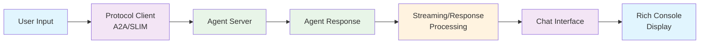

# A2A/SLIM Agent Chat CLI 🤖💬

### **🚀 A Lightweight and fast command-line chat interface.**
[](https://www.python.org/)
[](LICENSE)
[](https://github.com/cnoe-io/agent-chat-cli/actions/workflows/docker-build-publish.yml)
[](https://github.com/cnoe-io/agent-chat-cli/actions/workflows/test.yml)
[](https://github.com/cnoe-io/agent-chat-cli/actions/workflows/lint.yml)
[](https://github.com/cnoe-io/agent-chat-cli/actions/workflows/conventional_commits.yml)

A beautiful, interactive command-line interface for communicating with A2A (Agent-to-Agent) or SLIM protocol compliant agents. Features real-time streaming responses, animated ASCII spinners, and rich markdown rendering.

## ✨ Features

### 🚀 **Core Functionality**
- ⚡ **Real-time Streaming**: Display agent responses as they arrive with live text streaming
- 🌐 **Multi-Protocol Support**: Supports both A2A and SLIM protocols with streaming and non-streaming communication
- 📱 **Dual Display Mode**: Shows both real-time streaming text AND final formatted markdown output
- 🛡️ **Graceful Fallbacks**: Automatically falls back from streaming to non-streaming if needed

### 🎨 **User Experience**
- 💬 **Friendly and intuitive chat UI for the command-line interface**
- 🔄 **Command history support**
- ⏳ **Animated Spinner**: Classic ASCII spinner animation (`|`, `/`, `-`, `\`) while waiting
- 🔄 **Smooth Transitions**: Spinner → Arrow (`→`) → Streaming text → Final markdown panel
- 📝 **Rich Formatting**: Beautiful bordered panels with proper markdown rendering
- 🏷️ **Agent Branding**: Customized "AI Platform Engineer Response" panels

### 🔌 **Integration & Setup**
- 🔌 **Easy integration with A2A**
- 🔗 **Read and render A2A card on launch**
- 🔒 **Support passing OAuth2 Bearer Token or Shared Key**
- 🔐 **Authentication**: Supports optional token-based authentication

### 🛠️ **Technical Features**
- 📊 **Multiple Event Types**: Handles Task, TaskArtifactUpdateEvent, and TaskStatusUpdateEvent
- 🗂️ **Session Management**: Maintains conversation context across interactions
- 📋 **Comprehensive Logging**: Debug mode with detailed event processing logs
- ⚠️ **Error Handling**: Robust error handling with informative messages

## 🎯 Usage

### Docker Usage (Recommended)

```bash
# A2A mode (host-network may be required if your agent runs on the host)
docker run -it --network=host \
  -e AGENT_CHAT_PROTOCOL=a2a \
  -e A2A_HOST=localhost -e A2A_PORT=8000 \
  ghcr.io/cnoe-io/agent-chat-cli:stable
```
### SLIM mode

```bash
docker run -it --network=host\
  -e AGENT_CHAT_PROTOCOL=slim \
  -e SLIM_ENDPOINT=localhost:46357 \
  -e SLIM_REMOTE_CARD=http://localhost:46357/.well-known/agent.json \
  ghcr.io/cnoe-io/agent-chat-cli:stable
```

### Using uvx (non-docker)
```bash
# Run directly with uvx (no installation required)
# Use env var to choose protocol (defaults to slim when omitted)
AGENT_CHAT_PROTOCOL=a2a uvx https://github.com/cnoe-io/agent-chat-cli a2a
```

```bash
# With custom configuration
uvx https://github.com/cnoe-io/agent-chat-cli a2a --host your-agent-host --port 8080 --token your-token
```

```bash
AGENT_CHAT_PROTOCOL=slim uvx https://github.com/cnoe-io/agent-chat-cli.git
```

### Local Development Usage

#### 📋 Requirements

- Python 3.12+
- [uv](https://docs.astral.sh/uv/) package manager

#### 🛠️ Installation

1. **Install uv** (if not already installed):
   ```bash
   curl -LsSf https://astral.sh/uv/install.sh | sh
   ```

2. **Clone and Setup**:
   ```bash
   git clone https://github.com/cnoe-io/agent-chat-cli.git
   cd agent-chat-cli
   uv sync
   ```

3. **Environment Configuration**:
   ```bash
   export A2A_HOST=localhost       # Agent host (default: localhost)
   export A2A_PORT=8000            # Agent port (default: 8000)
   export A2A_TOKEN=""             # Authentication token (optional)
   export A2A_TLS=false            # Enable TLS (default: false)
   export A2A_DEBUG_CLIENT=false   # Enable debug logging (default: false)
   ```

```bash
# Activate virtual environment
source .venv/bin/activate

# Run with default settings (localhost:8000)
python -m agent_chat_cli a2a

# Run with custom host and port
python -m agent_chat_cli a2a --host your-agent-host --port 8080

# Run with authentication
python -m agent_chat_cli a2a --token your-auth-token

# Run with debug logging
python -m agent_chat_cli a2a --debug
```

### Interactive Commands
Once running, you can use these commands:
- Type any question or command for the agent
- `exit` or `quit` - Exit the chat
- `clear` - Clear the screen
- `history` - View chat history

### Example Interactions
```
🧑‍💻 You: show my github profile
⏳ Waiting for agent... |⏳ Waiting for agent... /⏳ Waiting for agent... →

Here is your GitHub profile information:
- Username: johndoe
- Name: John Doe
- Company: Example Corp
...

╭─────────────────────── AI Platform Engineer Response ────────────────────────╮
│                                                                              │
│  Here is your GitHub profile information:                                    │
│                                                                              │
│   • Username: johndoe                                                        │
│   • Name: John Doe                                                           │
│   • Company: Example Corp                                                    │
│   ...                                                                        │
╰──────────────────────────────────────────────────────────────────────────────╯
```


## 🏗️ Key Components

#### 1. **A2A Client (`a2a_client.py`)**
- **Purpose**: Core A2A protocol communication handler with advanced streaming capabilities
- **Key Features**:
  - Establish and maintain A2A agent connections
  - Handle both streaming and non-streaming communication
  - Process multiple event types (Task, TaskArtifactUpdateEvent, TaskStatusUpdateEvent)
  - Manage authentication and session context
  - Duck typing approach for flexible event handling

#### 2. **SLIM Client (`slim_client.py`)**
- **Purpose**: Communication handler for SLIM protocol agents
- **Key Features**:
  - Lightweight protocol implementation
  - SLIM-specific message formats and responses
  - Efficient communication patterns

#### 3. **Chat Interface (`chat_interface.py`)**
- **Purpose**: Rich console user interface with visual feedback
- **Key Features**:
  - Animated ASCII spinners for visual feedback
  - Beautiful markdown panels for responses
  - Command history and session management
  - Smooth visual transitions and timing coordination

#### 4. **Main Entry Point (`__main__.py`)**
- **Purpose**: CLI argument parsing, environment configuration, and protocol selection
- **Key Features**:
  - Command-line argument parsing using Click
  - Environment variable configuration
  - Protocol selection (A2A, SLIM, MCP)
  - Interactive setup prompts

### Communication Flow



### Event Processing

The A2A client handles three types of streaming events using a duck typing approach:

1. **Task Events**: Initial task creation (usually empty content)
2. **TaskArtifactUpdateEvent**: Contains actual response content in `artifact.parts[].root.text`
3. **TaskStatusUpdateEvent**: Status updates (usually empty content)

**Duck Typing Benefits**:
- More flexible than rigid type checking
- Works with current and future A2A event types
- Handles various event structures gracefully

## 🔧 Configuration

### Environment Variables

| Protocol | Variable | Default | Description |
|----------|----------|---------|-------------|
| **A2A** | `A2A_HOST` | `localhost` | Agent server hostname |
| **A2A** | `A2A_PORT` | `8000` | Agent server port |
| **A2A** | `A2A_TOKEN` | `""` | Authentication token (optional) |
| **A2A** | `A2A_TLS` | `false` | Enable TLS/HTTPS (`true`/`1`/`yes` to enable) |
| **A2A** | `A2A_DEBUG_CLIENT` | `false` | Enable debug logging |
| **SLIM** | `SLIM_ENDPOINT` | - | Agent endpoint (e.g., `127.0.0.1:46357`) |
| **SLIM** | `SLIM_REMOTE_CARD` | - | Agent card URL, JSON string, or file path |

### Command Line Options

```bash
python -m agent_chat_cli a2a [OPTIONS]

Options:
  --host TEXT     Agent host (overrides A2A_HOST)
  --port INTEGER  Agent port (overrides A2A_PORT)
  --token TEXT    Authentication token (overrides A2A_TOKEN)
  --debug         Enable debug logging
  --help          Show help message
```

## 🐛 Debugging

### Enable Debug Mode
```bash
export A2A_DEBUG_CLIENT=true
python -m agent_chat_cli a2a --debug
```

### Debug Output Example
```
DEBUG: Received user input: show my github profile
DEBUG: Connecting to agent at http://localhost:8000
DEBUG: Successfully connected to agent
DEBUG: Created payload with message ID: abc123...
DEBUG: Sending streaming message to agent...
DEBUG: Received streaming chunk #1: <class 'a2a.types.SendStreamingMessageResponse'>
DEBUG: Processing event: <class 'a2a.types.Task'>, has status: True
DEBUG: Extracted text from status: ''
DEBUG: Received streaming chunk #2: <class 'a2a.types.SendStreamingMessageResponse'>
DEBUG: Processing event: <class 'a2a.types.TaskArtifactUpdateEvent'>, has status: False
DEBUG: Found artifact: <class 'a2a.types.Artifact'>, has parts: True
DEBUG: Added text from part.root.text: 'Here is your GitHub profile...'
```

## 🎨 User Experience

### Visual Flow
1. **Welcome Panel**: Beautiful branded welcome message with agent capabilities
2. **Animated Spinner**: Engaging ASCII animation while waiting for response
3. **Real-time Streaming**: Text appears as the agent generates it
4. **Final Presentation**: Beautifully formatted markdown panel with complete response

### Responsive Design
- Adapts to terminal width
- Proper text wrapping and formatting
- Consistent visual hierarchy
- Professional appearance

## 🔒 Security

- **Optional Authentication**: Supports Bearer token authentication
- **TLS Support**: Can connect over HTTPS when enabled
- **Session Isolation**: Each session has unique context ID
- **Input Validation**: Proper handling of user input and agent responses

## 🚀 Performance

- **Streaming Optimization**: Real-time display without buffering delays
- **Connection Pooling**: Efficient HTTP client with connection reuse
- **Memory Management**: Proper cleanup of resources and connections
- **Timeout Handling**: 300-second timeout for long-running operations

## 🧪 Testing

### Manual Testing
```bash
# Test basic functionality
echo "hello" | python -m agent_chat_cli a2a --host localhost --port 8000

# Test with different questions
echo "what actions can you perform?" | python -m agent_chat_cli a2a

# Test error handling
echo "test" | python -m agent_chat_cli a2a --host invalid-host --port 9999
```

### Key Design Decisions

1. **Duck Typing Over Type Checking**: Uses `hasattr()` and `getattr()` instead of `isinstance()` for better flexibility
2. **Streaming + Final Display**: Shows both real-time streaming and final formatted output
3. **Graceful Degradation**: Falls back to non-streaming if streaming fails
4. **Rich Console**: Uses Rich library for beautiful terminal output
5. **Session Context**: Maintains conversation continuity with context IDs

### Development Setup

```bash
# Install uv if not already installed
curl -LsSf https://astral.sh/uv/install.sh | sh

# Clone and setup
git clone https://github.com/cnoe-io/agent-chat-cli.git
cd agent-chat-cli
uv sync

# Run tests
uv run pytest

# Run linting
uv run ruff check agent_chat_cli tests

# Build package
uv build
```

### Error Handling Strategy

The CLI implements hierarchical error handling:

```
Application Level → Protocol Level → Transport Level → System Level
```

**Error Categories**:
1. **Connection Errors**: Network issues, agent unavailability
2. **Authentication Errors**: Invalid tokens, authorization failures
3. **Protocol Errors**: Malformed responses, unsupported features
4. **Processing Errors**: Text extraction failures, rendering issues

**Recovery Mechanisms**:
- **Graceful Degradation**: Streaming → Non-streaming fallback
- **Retry Logic**: Automatic reconnection for transient failures
- **User Feedback**: Clear error messages and recovery suggestions
- **Debug Support**: Comprehensive logging for troubleshooting

## 🔧 Debugging

### Enable Debug Mode
```bash
export A2A_DEBUG_CLIENT=true
uv run python -m agent_chat_cli a2a --debug
```

### Debug Output Example
```
DEBUG: Received user input: show my github profile
DEBUG: Connecting to agent at http://localhost:8000
DEBUG: Successfully connected to agent
DEBUG: Created payload with message ID: abc123...
DEBUG: Sending streaming message to agent...
DEBUG: Received streaming chunk #1: <class 'a2a.types.SendStreamingMessageResponse'>
DEBUG: Processing event: <class 'a2a.types.Task'>, has status: True
DEBUG: Extracted text from status: ''
DEBUG: Received streaming chunk #2: <class 'a2a.types.SendStreamingMessageResponse'>
DEBUG: Processing event: <class 'a2a.types.TaskArtifactUpdateEvent'>, has status: False
DEBUG: Found artifact: <class 'a2a.types.Artifact'>, has parts: True
DEBUG: Added text from part.root.text: 'Here is your GitHub profile...'
```

## 🤝 Contributing

### Development Guidelines
1. Follow existing code style and documentation patterns
2. Add comprehensive docstrings to new functions
3. Test both streaming and non-streaming modes
4. Ensure proper error handling and logging
5. Update documentation for new features

### Code Quality
- **Comprehensive Documentation**: Detailed inline and external documentation
- **Maintainable Architecture**: Clean separation of concerns
- **Extensible Design**: Plugin-ready for future enhancements
- **Robust Error Handling**: Graceful handling of all error scenarios

### Testing

```bash
# Run all tests
make test

# Run linting
make lint

# Auto-fix lint issues
make ruff-fix

# Test specific functionality
echo "hello" | uv run python -m agent_chat_cli a2a --host localhost --port 8000
```

## Quick Demos

### Google A2A Demo


## 📄 License

This project is licensed under the Apache License 2.0 - see the [LICENSE](LICENSE) file for details.

## 👥 Contributing

Contributions are welcome! Please feel free to submit a Pull Request.
